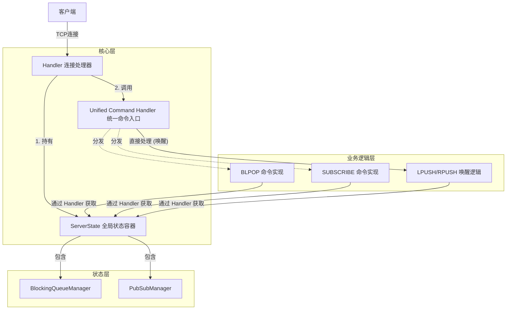

# Rudis 异步命令架构设计文档

本文档详细阐述了 Rudis 服务端处理异步命令（如阻塞列表、发布订阅等）的架构设计。该架构旨在实现核心逻辑与具体业务的解耦，提供高扩展性的开发体验。

## 1. 设计背景与目标

在 Redis 协议中，大部分命令是同步请求-响应模式，但存在一类特殊的**异步/状态相关命令**：
- **阻塞命令**：如 `BLPOP`, `BRPOP`，需要挂起客户端连接，直到满足条件或超时。
- **状态命令**：如 `SUBSCRIBE` (Pub/Sub)，使连接进入特定模式，长期监听事件。
- **流命令**：如 `XREAD BLOCK`，涉及复杂的偏移量和消费者组状态。

**设计目标**：
1.  **解耦 (Decoupling)**：`Server` 和 `Handler` 不应被具体的业务逻辑（如 List 逻辑）污染。
2.  **统一 (Unification)**：提供统一的状态管理入口，避免散乱的管理器。
3.  **扩展性 (Extensibility)**：新增功能（如 Pub/Sub）时，无需修改核心网络处理代码。

---

## 2. 核心架构设计

### 2.1 架构概览



### 2.2 核心组件说明

#### 1. `ServerState` (状态容器)
- **位置**: `src/server/state.rs`
- **职责**: 全局单例容器，持有所有跨连接的共享资源。
- **关键设计**:
  - **集中初始化**: 负责初始化内部所有 Manager 及其后台清理任务。
  - **统一清理**: 提供 `cleanup_session(id)` 接口，当客户端断开时，一键清理该会话在所有子系统中的残留状态。

#### 2. `Handler` (连接处理器)
- **位置**: `src/server.rs`
- **职责**: 处理 TCP 读写和协议解析。
- **关键设计**:
  - **无业务感知**: 不包含任何 `blocking`, `pubsub` 字眼。
  - **只持有容器**: 通过 `self.state` 访问资源，不知道具体内容。

#### 3. `Unified Command Handler` (统一入口)
- **位置**: `src/server/command_handler.rs`
- **职责**: 识别并分发需要 Handler 上下文的命令。
- **关键设计**:
  - **拦截器**: `try_apply_command` 拦截特殊命令。
  - **唤醒逻辑**: 集中处理 `LPUSH` 等写命令的唤醒逻辑 (`try_wakeup_for_command`)。

---

## 3. 设计模式应用

| 模式名称 | 应用场景 | 优势 |
| :--- | :--- | :--- |
| **容器模式 (Container/Context)** | `ServerState` | 消除 Server/Handler 对几十个具体 Manager 的依赖，避免构造函数爆炸。 |
| **观察者模式 (Observer)** | `cleanup_session` | 核心层作为 Subject 通知状态层；状态层作为 Observer 处理清理逻辑，反向解耦。 |
| **策略模式 (Strategy)** | `HandlerAsyncCommand` | 定义 `apply(handler)` 接口，不同异步命令实现各自的执行策略。 |
| **RAII / 守卫模式** | `BlockingQueueManager` | 利用 Rust 的 Drop 机制或显式清理，确保资源不泄漏。 |

---

## 4. 数据结构设计

### 4.1 ServerState (src/server/state.rs)
```rust
pub struct ServerState {
    // List 阻塞管理器
    pub blocking_list: Arc<Mutex<BlockingQueueManager>>,
    
    // 预留位置：Pub/Sub
    // pub pubsub: Arc<Mutex<PubSubManager>>,
}
```

### 4.2 HandlerAsyncCommand Trait (src/cmds/async_command.rs)
```rust
pub trait HandlerAsyncCommand: Sized + Clone {
    fn parse_from_frame(frame: Frame) -> Result<Self, Error>;
    
    // 核心执行方法，传入 Handler 上下文
    async fn apply(self, handler: &mut Handler) -> Result<Frame, Error>;
}
```

---

## 5. 关键调用流程详解

### 5.1 阻塞命令执行流程 (以 BLPOP 为例)

1.  **解析**: `Handler` 收到字节流，解析为 `Command::Blpop`。
2.  **分发**: `Handler` 调用 `try_apply_command`。
3.  **执行**: 进入 `Blpop::apply` (位于 `src/cmds/listing/blpop.rs`)。
    *   通过 `handler.get_state().blocking_list` 获取锁。
    *   调用 `register_blocking_request` 注册当前 Session ID 和感兴趣的 Keys。
    *   释放锁。
4.  **挂起**: 使用 `tokio::select!` 监听具体的 `Receiver` 或 `sleep` 超时。

### 5.2 唤醒流程 (以 LPUSH 为例)

1.  **执行**: `Handler` 收到 `LPUSH`，调用 `try_apply_command`。
2.  **检查**: 调用 `handle_blocking_aware_command`。
3.  **查询**: 锁定 `state.blocking_list`，查询是否有等待该 Key 的 Session。
4.  **分支**:
    *   **有等待者**: 直接将 Value 通过 Channel 发送给等待的 Session，**数据不入库**，返回客户端 OK。
    *   **无等待者**: 调用 `handler.apply_db_command`，数据正常入库。

### 5.3 异常断开清理流程

1.  `Handler::handle` 在 `read_bytes` 时捕获到连接断开/错误。
2.  `Handler` 调用 `self.state.cleanup_session(id)`.
3.  `ServerState` 依次调用内部 Manager 的清理方法：
    *   `blocking_list.cleanup_session(id)`
    *   (未来) `pubsub.unsubscribe_all(id)`
4.  资源释放完毕，Handler 退出循环。

---

## 6. 举一反三：实战扩展指南

**场景：如何添加 Pub/Sub (发布订阅) 功能？**

在现在的架构下，只需要按照以下“填空题”式的步骤进行：

### 步骤 1：定义数据结构
新建 `src/store/pubsub.rs`，实现 `PubSubManager`。
```rust
pub struct PubSubManager {
    // 频道 -> 订阅者列表
    channels: HashMap<String, Vec<usize>>, 
}
impl PubSubManager {
    pub fn subscribe(&mut self, channel: String, session_id: usize) { ... }
    pub fn unsubscribe_all(&mut self, session_id: usize) { ... }
}
```

### 步骤 2：扩充 ServerState
修改 `src/server/state.rs`：
```rust
pub struct ServerState {
    pub blocking_list: Arc<Mutex<BlockingQueueManager>>,
    // 1. 新增字段
    pub pubsub: Arc<Mutex<PubSubManager>>, 
}

impl ServerState {
    pub fn new() -> Self {
        // 2. 初始化
        let pubsub = Arc::new(Mutex::new(PubSubManager::new()));
        ServerState {
            blocking_list: ...,
            pubsub,
        }
    }

    pub async fn cleanup_session(&self, session_id: usize) {
        // ... 原有逻辑
        // 3. 新增清理逻辑
        self.pubsub.lock().await.unsubscribe_all(session_id);
    }
}
```

### 步骤 3：实现命令
新建 `src/cmds/pubsub/subscribe.rs`，实现 `HandlerAsyncCommand`。
```rust
async fn apply(self, handler: &mut Handler) -> Result<Frame, Error> {
    // 通过 state 获取资源
    let mut pubsub = handler.get_state().pubsub.lock().await;
    pubsub.subscribe(self.channel, handler.get_session().get_id());
    // ...
}
```

### 步骤 4：注册命令入口
修改 `src/server/command_handler.rs` 的 `try_apply_command`：
```rust
match command {
    // ...
    Command::Subscribe(cmd) => Some(HandlerAsyncCommand::apply(cmd, handler).await),
    // ...
}
```

**结论**：可以看到，整个过程**完全没有修改** `Server` 的构造函数、`Handler` 的处理循环或网络层代码。这就是优秀架构带来的扩展能力。
