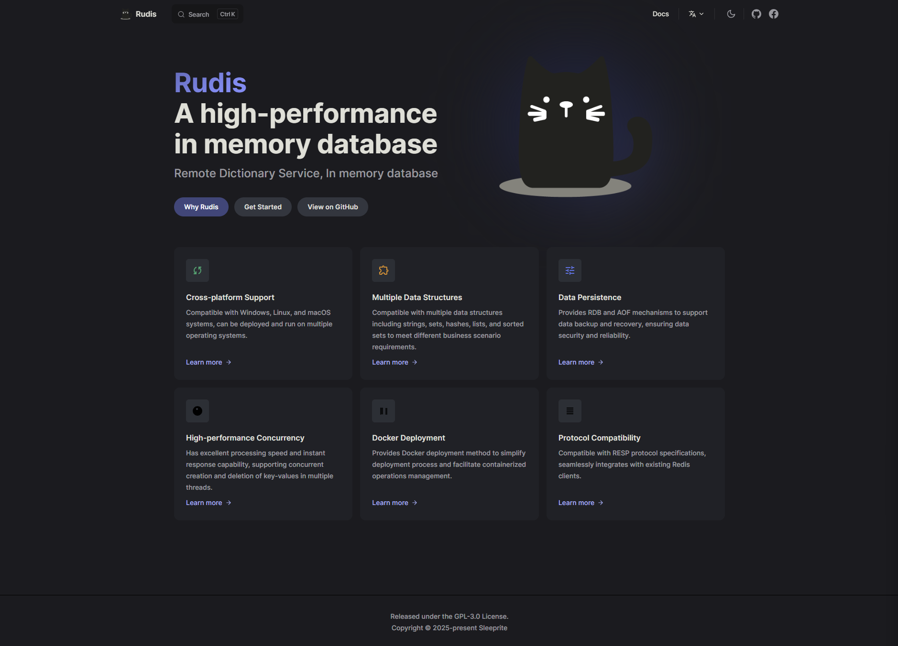
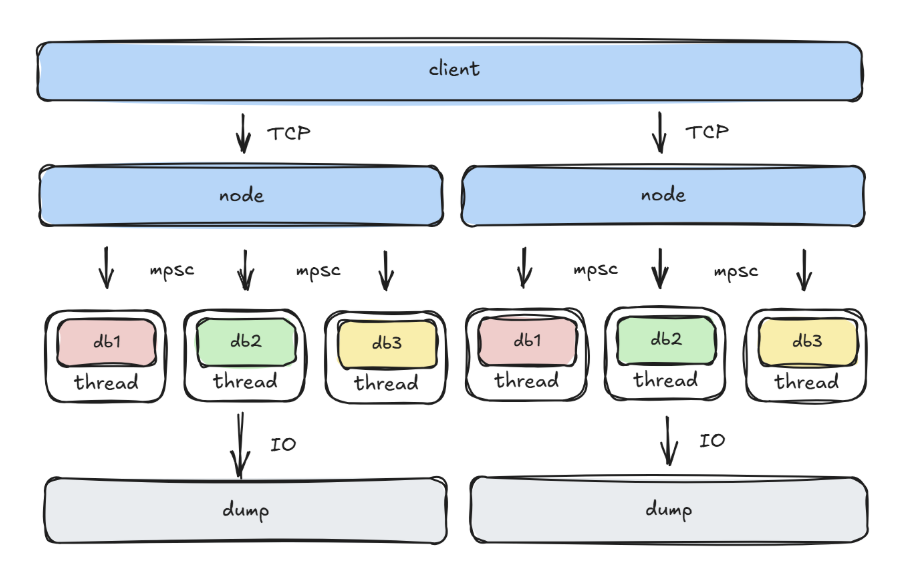
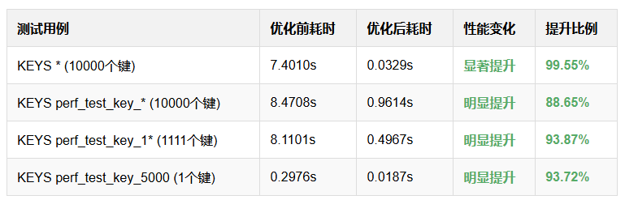
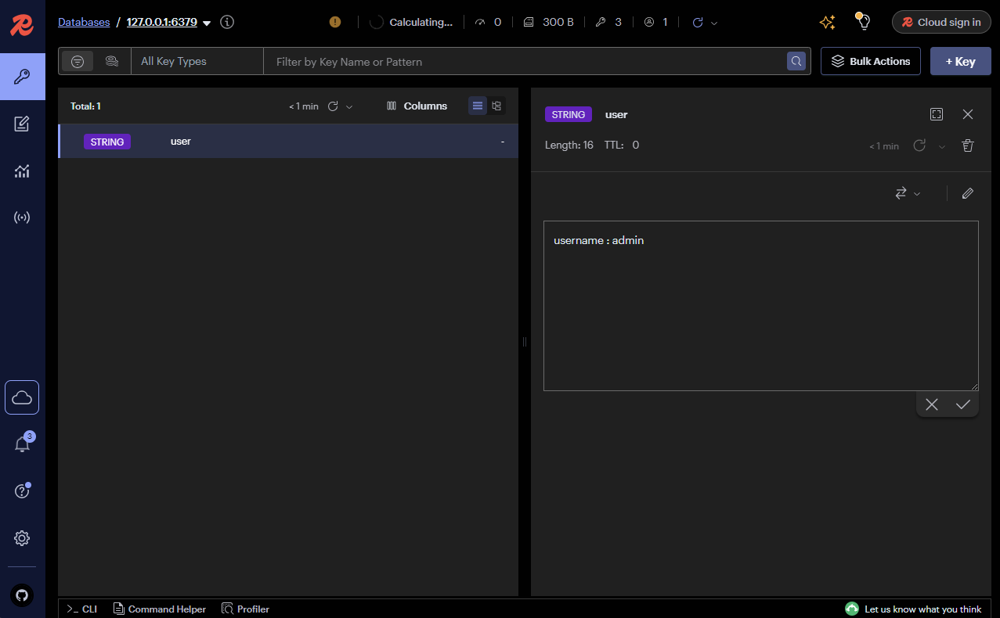

# Rudis v0.2.0 重大更新发布！

🚀 **性能提升 & 功能增强** 🚀

我们很高兴地宣布 Rudis v0.2.0 正式发布！此版本带来了多项重要改进和功能增强，包括架构升级、主从复制、事务支持等核心功能，以及扫描命令增强、数据结构操作扩展、配置管理强化等多项实用特性。



### ⚡ 架构升级

v0.2.0 版本对 Rudis 的底层架构进行了重大升级。我们将 Tokio 异步运行时升级至 1.48.0 版本，采用最新的异步技术提升系统性能和稳定性。同时，我们将线程模型由 shared-everything 构替换为 shared-nothing 架构，显著提高了系统的并发处理能力。此外，我们还优化了 RESP 解析器，解决了命令粘包问题，确保网络传输的可靠性。



### 🔄 主从复制

在 v0.2.0 版本中，我们引入了全新的 replication 主从复制模式。该机制支持完整的主从复制功能，包括连接建立、握手、全量同步和增量同步等各个环节。通过 PSYNC 命令实现主从节点的连接和数据同步，不仅支持断线重连，还能进行增量数据传输，有效减少了网络带宽消耗和同步时间。同时，我们对 RDB 持久化进行了重构，优化了底层逻辑，提高了数据恢复效率。

主从复制设置非常简单，只需在从节点配置文件中添加 replicaof 配置项，指定主节点的 IP 地址和端口号即可。例如：replicaof 192.168.1.100 6379。启动从节点后，它会自动连接到主节点并开始数据同步。

### 💼 事务支持

v0.2.0 版本还增加了完整的事务功能，支持 exec、multi、discard 命令，实现了 Redis 风格的事务处理。我们在 Session 中维护事务状态和命令队列，支持事务的开始、执行和取消等完整生命周期管理，为用户提供了一致性和原子性的操作保证。

事务的基本用法如下：1. 使用 MULTI 命令开始一个事务 2. 执行多个命令，这些命令会被加入到事务队列中而不会立即执行 3. 使用 EXEC 命令执行事务中的所有命令 4. 或者使用 DISCARD 命令取消事务，示例：

```
127.0.0.1:6379> MULTI
OK
127.0.0.1:6379> SET key1 value1
QUEUED
127.0.0.1:6379> SET key2 value2
QUEUED
127.0.0.1:6379> EXEC
1) OK
2) OK
```

### 🔥 性能优化

在 v0.2.0 版本中，我们对 Keys 命令的内部算法实现进行了重构。通过改进数据结构和查询逻辑，在大数据集场景下性能提升高达 99.55%，显著减少了命令执行时间，为用户带来更流畅的使用体验。



### 🛠️ 兼容改进

我们还解决了与 Redis-insight 的 Set 预览兼容性问题，确保可视化工具能够正常使用，提升了用户的开发和调试体验。



### ⚙️ 配置强化

v0.2.0 版本还强化了配置管理功能。我们新增了 maxclients 配置项，可以限制客户端连接数量，防止过多连接导致系统资源耗尽，从而提升服务稳定性。同时，我们还增加了 appendsync 配置项，提供三种 AOF 持久化策略：always（每次写入同步）、everysec（每秒同步）、no（不同步），用户可以根据性能和安全性需求灵活选择。

```rudis.conf
# 名称：同步策略
# 描述：AOF文件数据同步到磁盘的频率策略
appendfsync everysec

# 名称：最大客户端连接数
# 描述：服务器允许的最大客户端连接数量，0表示无限制
maxclients 3
```

### 🧪 命令扩展

为了确保系统的稳定性和功能完整性，我们在 v0.2.0 版本中新增了 43 个命令，大幅扩展了功能覆盖面。同时，我们编写了超多测试用例，确保代码质量和功能稳定性。v0.2.0 版本重点增强了扫描命令功能。SCAN 命令支持增量迭代数据库中的键，有效避免了传统 KEYS 命令可能导致的阻塞问题。该命令支持 MATCH 模式匹配和 COUNT 参数控制返回数量，通过游标机制确保遍历的完整性。同时，我们还增加了 SSCAN 命令，可以针对 Set 类型的成员进行增量扫描，同样支持 MATCH 和 COUNT 参数，非常适合大型集合的遍历场景。在 v0.2.0 版本中，我们进一步扩展了数据结构的操作命令。LTRIM 命令可以对列表类型进行修剪，保留指定范围内的元素，支持负数索引，可实现列表大小控制和滑动窗口功能。SDIFF 命令用于计算多个集合间的差集，返回存在于第一个集合但不在其他集合中的成员，非常适合权限控制等应用场景。SETRANGE 命令可以在字符串指定偏移位置设置值，支持部分更新而无需获取整个字符串，大大提高了大字符串局部修改的效率。

## 📊 技术亮点

Rudis 继续保持与 Redis API 的高度兼容，同时利用 Rust 语言优势提供卓越的性能表现。系统支持跨平台部署（Windows/Linux/macOS），支持字符串、集合、哈希、列表、有序集合等多种数据结构，具备完善的 RDB 与 AOF 持久化机制，拥有高效的主从复制功能和完整的事务处理能力。

立即体验更强大的 Rudis！👉 https://github.com/sleeprite/rudis

#Rust #Redis #Database #Performance #KeyValueStore